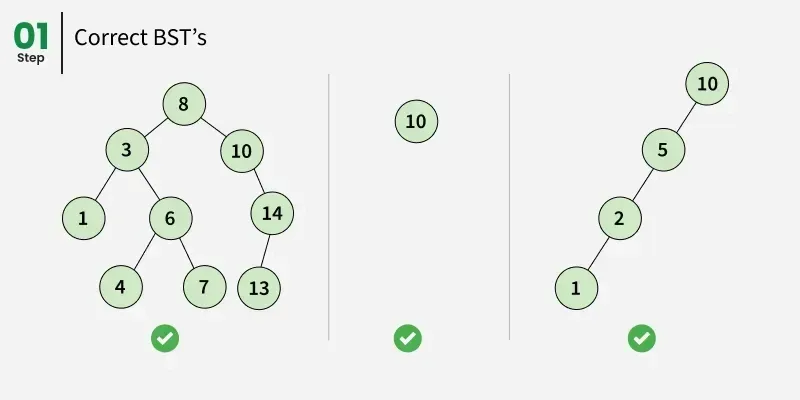

# BST - Binary Search Tree



## Using

1. Init
```go
bst := &BST{}
```

2. Use 
```go
fmt.Println("inserting 5:", bst.Insert(5)) // true
fmt.Println("inserting 3:", bst.Insert(3)) // true
fmt.Println("inserting 8:", bst.Insert(8)) // true
fmt.Println("inserting 1:", bst.Insert(1)) // true
fmt.Println("inserting 4:", bst.Insert(4)) // true
fmt.Println("inserting 4:", bst.Insert(4)) // false

fmt.Println("--- --- 1 level --- ---")

fmt.Println("root", bst.root) // 5

fmt.Println("--- --- 2 level --- ---")

fmt.Println("root left child", bst.root.Left)   // 3
fmt.Println("root right child", bst.root.Right) // 8

fmt.Println("--- --- 3 level --- ---")

fmt.Println("root left child left child", bst.root.Left.Left)     // 1
fmt.Println("root left child right child", bst.root.Left.Right)   // 4
fmt.Println("root right child left child", bst.root.Right.Left)   // null
fmt.Println("root right child right child", bst.root.Right.Right) // null


fmt.Println("--- --- TESTS --- ---")
fmt.Println("Search 8 (exists):", bst.Search(8))                   // true
fmt.Println("Search 35 (doesn't exists):", bst.Search(35))         // false
```