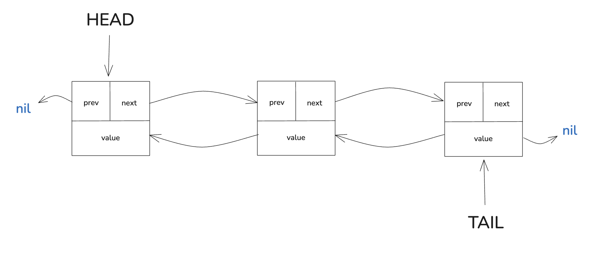

# Doubly Linked List



## Using

1. Init list

```go
list := &DoublyLinkedList{}
```

---

2. Pushing and Poping Elements from Front and Back

```go
list.PushBack(25)
list.PushBack(5)
list.PushFront(2)

// list = [2, 25, 5]

head, ok := list.PopHead() // head = 2
tail, ok := list.PopTail() // tail = 5

// list = [25]
```

---

3. Pushing and Poping at special index

```go
list.PushBack(25)
list.PushBack(5)
list.PushAt(2)

// list = [25, 8, 5]

val, ok := list.PopAt(1) // val = 8

// list = [25, 5]
```

---

4. Get Tail and Head of a list

```go
// list = [2, 25, 5]

head, ok := list.Head() // head = 2
tail, ok := list.Tail() // tail = 5

// list = [2, 25, 5]
```

---

5. Length and isEmpty

```go
// list = [2, 25, 5]

length := list.Len() // 3
isEmpty := list.IsEmpty() // false
```

---

6. Clearing list 

```go
// list = [2, 25, 5]

list.Clear()

// list = []
```

---

7. Finding element

```go
// list = [2, 25, 5]

err := list.Find(25) // true

```

---

8. Traversal and Printing elements

```go
// list = [2, 25, 5]

list.TraverseFromHead()
// output: 2 <-> 25 <-> 5

list.TraverseFromTail()
// output: 5 <-> 25 <-> 2

```