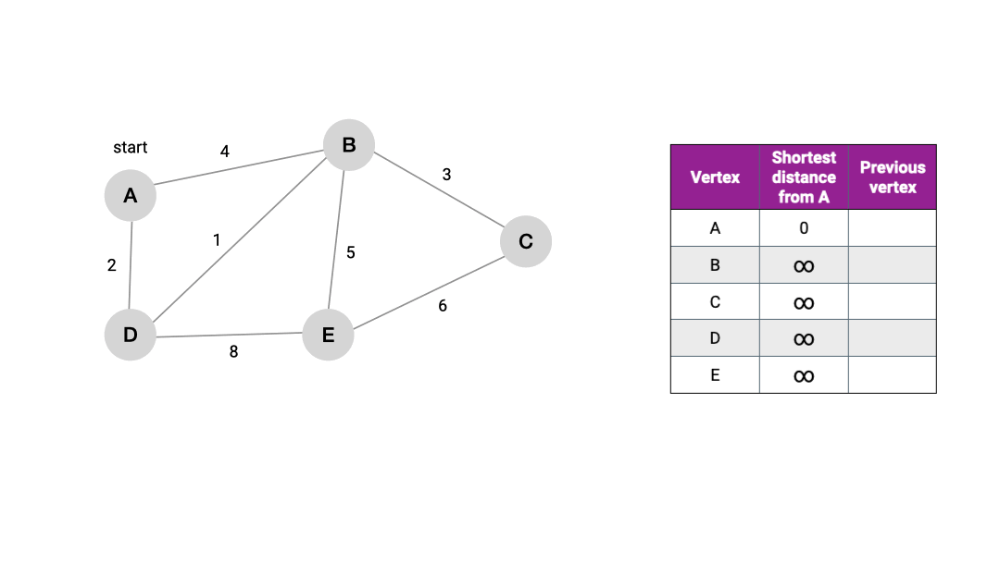

# Dijkstra algorithm



## Using

1. Init graph like this

```go
graph := map[rune][]Edge{
    'a': {
        {'b', 3}, {'c', 1},
    },
    'b': {
        {'e', 6},
    },
    'c': {
        {'d', 2}, {'f', 9},
    },
    'd': {
        {'e', 3},
    },
    'e': {
        {'g', 4},
    },
    'f': {
        {'e', 12},
    },
    'g': {},
}
```
---
2. Use algorithm

```go
res := dijkstra(graph, 'a')
for vertex, cost := range res {
    fmt.Printf("%s: %v\n", string(vertex), cost)
}
```